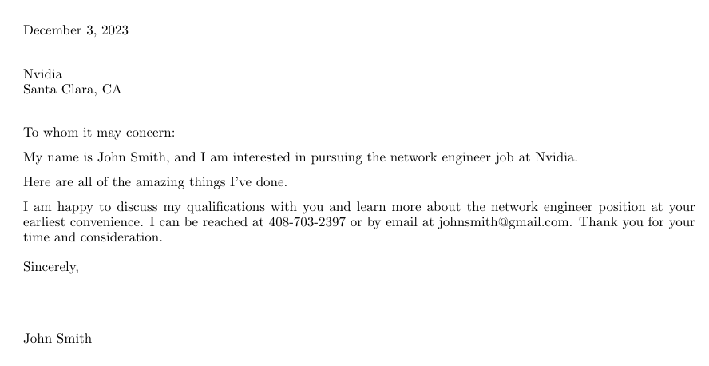

# Cover letter
Generate custom cover letters in PDF format.

## Installation

Install Latex on your system. For Ubuntu, this is

```
sudo apt install texlive-latex-extra
sudo apt install latexmk
sudo apt install texlive-fonts-extra
```

and generate your .pdf file with
```pdflatex my-cover-letter.tex```
 
Create a virtual environment and install the requirements 

```python
virtualenv -p python3.8 .venv
source .venv/bin/activate
pip install -r requirements.txt
```
or use 
```python
python3 -m venv .venv
source .venv/bin/activate
pip install -r requirements.txt
```

Create a cover letter by running `python gen_cover_letter.py`

Fill in the requested information and press 'Enter' after each prompt. Here is an example:


The resulting PDF will look like



The main body text of the cover letter is located in `template.txt`.